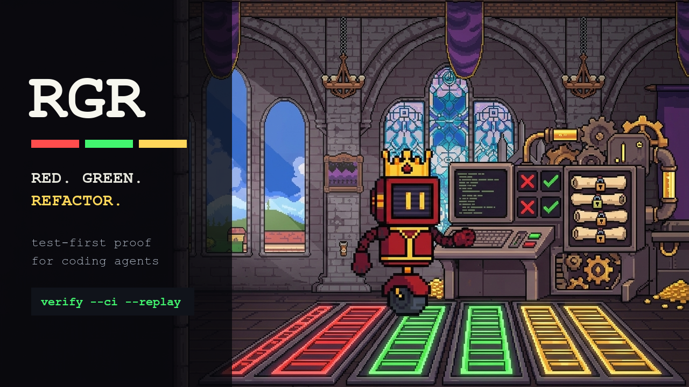

# RGR



`rgr` is a no-dependency Red-Green-Refactor gate for coding agents. It gives agents a human-operator style CLI that records the failing test first, freezes that test with hashes and snapshots, and refuses to mark Green or Refactor if the Red test was edited.

## Install

Clone the repo and run it with Bun:

```bash
git clone https://github.com/kingbootoshi/rgr.git
cd rgr
bun run rgr -- --help
```

Optional: link the CLI onto your PATH:

```bash
bun link
rgr --help
```

From this repo:

```bash
bun run rgr -- --help
```

From another repo:

```bash
bun run /path/to/rgr/src/cli/index.ts --root . --help
```

The workflow examples below assume `rgr` is on your PATH. If it is not, replace `rgr` with `bun run /path/to/rgr/src/cli/index.ts`.

## Agent Plugins

RGR ships one shared skill as both a Claude Code plugin and a Codex plugin.

Claude Code:

```bash
claude plugin marketplace add kingbootoshi/rgr
claude plugin install rgr@rgr
```

For local Claude Code testing from a clone:

```bash
claude --plugin-dir .
```

Codex:

- Plugin manifest: `.codex-plugin/plugin.json`
- Shared skill: `skills/rgr/SKILL.md`
- Codex UI metadata: `skills/rgr/agents/openai.yaml`

Install the repo root as the plugin directory in Codex, then invoke `$rgr` when a code change should use strict Red-Green-Refactor proof.

## Core Workflow

```bash
# 1. Initialize a manifest for this goal.
rgr init --goal-id billing-scope

# 2. Write only the failing test, then capture Red.
rgr red --strict --goal-id billing-scope --test src/billing.test.ts -- bun test src/billing.test.ts

# Optional: explicitly freeze a helper, fixture, snapshot, or config file that defines the Red oracle.
rgr red --strict --goal-id billing-scope --test src/billing.test.ts --protect tests/fixtures/billing.ts -- bun test src/billing.test.ts

# 3. Implement production code, then prove Green.
rgr green

# 4. Refactor only while the Red test is still byte-for-byte unchanged.
rgr refactor -- bun test

# 5. Final gate for local CI or sandbox authority.
rgr verify --ci --replay -- bun test
```

Every run writes `.rgr/manifest.json`, `.rgr/events.jsonl`, snapshots, diffs, and command output logs.

When an older completed cycle has known replay-only environment noise, targeted replay can keep later cycles moving while still requiring Green receipts, protected heads, and the final verify command. Treat this as an exception path and report the replay scope.

```bash
# Replay only the latest active cycle.
rgr verify --ci --replay --cycle latest -- bun test

# Replay active cycles from a known cycle onward.
rgr verify --ci --replay --from-cycle 004 -- bun test
```

## What It Enforces

- Red must fail.
- Red defaults to test-surface changes only.
- Red records protected test files with SHA-256 hashes and snapshots.
- Green refuses to run if any protected Red file changed.
- Refactor and Verify refuse to pass if protected Red files changed.
- Every command proof uses argv after `--`, currently direct `bun test` only.
- Green runs the exact Red command.
- Strict Red protects imported test helpers, fixtures, snapshots, package/test config, and lockfiles that can change what the test means.
- `--test` is only for root assertion-bearing tests; use `--protect` for helpers, fixtures, snapshots, and test config.
- `inspect-test` inspects root tests and reports protected support separately, so fixtures are not warned for lacking `expect()`.
- `verify --ci --replay` reconstructs the Red proof from the recorded git base commit and protected snapshots.
- `verify --ci --replay --cycle latest` replays only the latest active cycle; `--from-cycle <id>` replays active cycles from that id onward and reports skipped active cycles.
- Same-file multi-cycle work is supported through current protected heads: each Red hash is frozen through its Green, then a later Red can intentionally advance the file.
- Wrong tests must be superseded through `rgr revise-test`, then replaced by a new Red proof.
- `verify --ci` requires every active cycle to have Red and Green receipts.
- `--allow-source-changes` permits reviewed source dirtiness that already existed before Red starts and snapshots that dirty source into replay; the Red command itself may not create commits or modify source files.

## Threat Model

This tool gives honest agents and CI a deterministic contract. If an agent has unrestricted write access to the same repo, it can still delete `.rgr` or bypass the CLI. Treat local use as a discipline gate and make `rgr verify --ci --replay -- bun test` mandatory inside CI, sandboxes, or agent harnesses when the result must be authoritative.

For authority, use strict replay:

```bash
rgr verify --ci --replay -- bun test
```

## Test Discipline Prompt

Use:

```bash
rgr prompt
```

It prints a compact instruction block for agents that need to write meaningful tests instead of shallow mock-echo tests.
